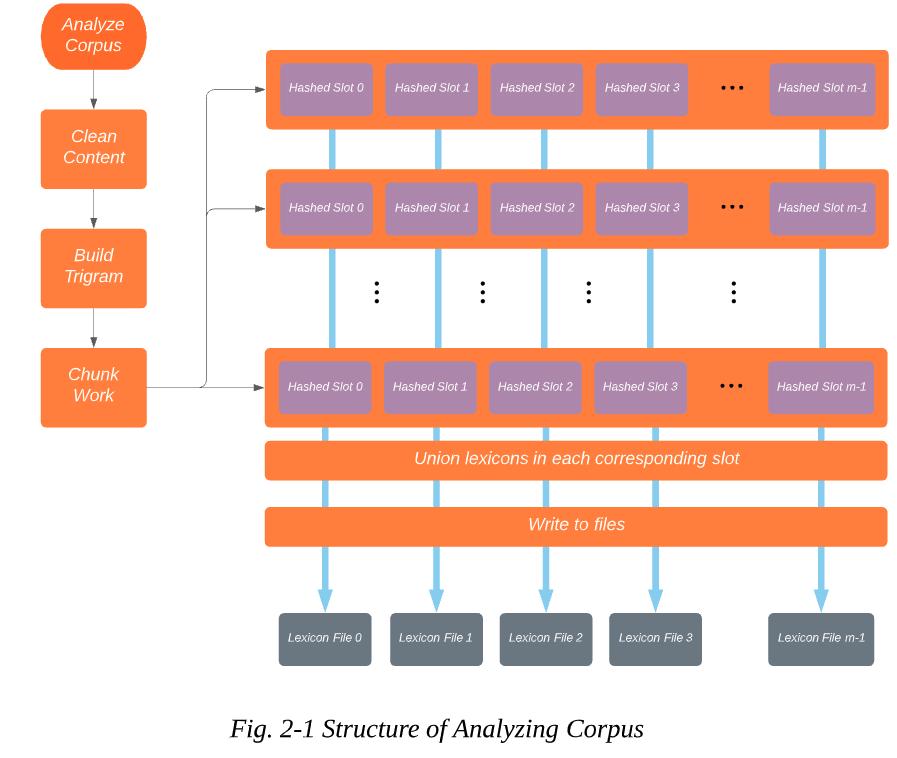
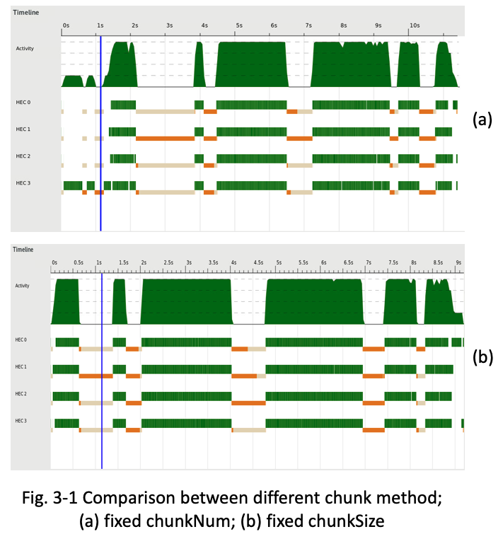
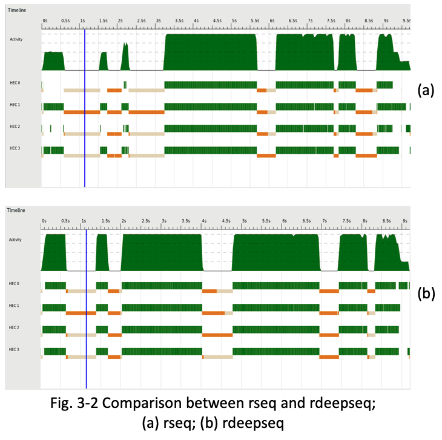
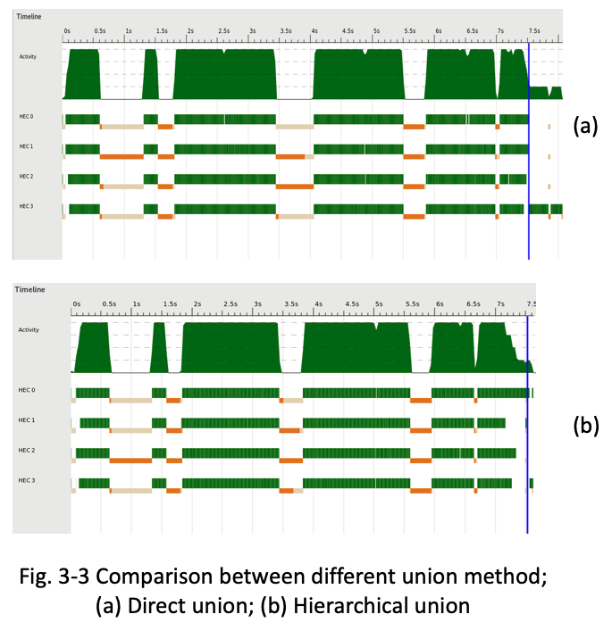
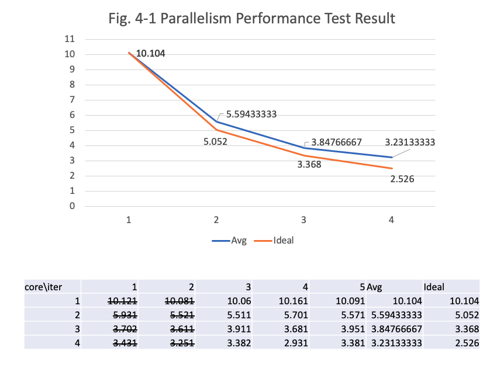
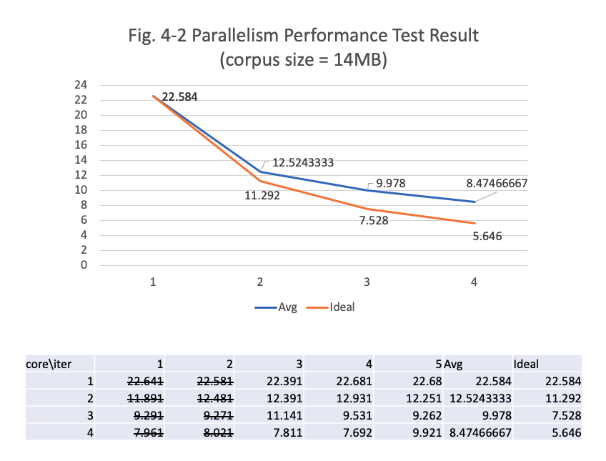
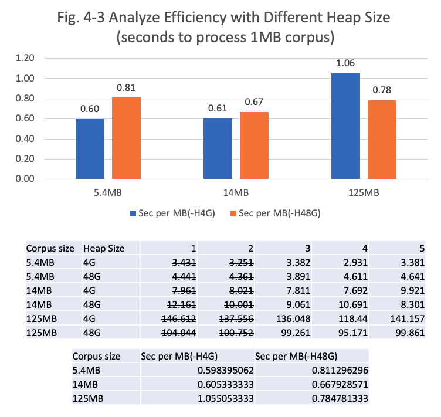

# Haskell-Words-Auto-Completion

## 1. Problem Definition

The auto-completion feature is aimed to help users type what they want more easily. Users can type a fraction of words or sentences. Then the program will predict what should follow next. There are serval kinds of auto-completion for different tasks. Here we use terminologies in ElasticSearch[[Ref Link]](https://www.elastic.co/guide/en/elasticsearch/reference/current/search-suggesters.html) to describe them.

In this project, the Phrase Suggest is used to illustrate how performance benefits from parallelism.

### Phrase Suggester
Given a string p, find most possible k words following after p in the corpus. (The max suggestion number k is defined as a constant )

Example:

Input: p = "some"

Output: t = ["apples", "bananas", "hints"]

### Other constraints
- All the words should only consist of lowercase characters (a-z), hyphen (-), apostrophe (').
- If the number of valid candidates is less than k, return all the candidates.

## 2. Implementation

### Analyze Corpus

To achieve parallelism, a MapReduce-like structure is built for the Phrase Suggester. The analyzing stages are described as Fig. 2-1.



### Query String

Compared to analyzing, query time is much shorter. And operations are sequential.

1. Extract bigram at the end of the string. If no such a valid bigram, quit.
2. Use the hash value of the bigram to locate the lexicon and load it.
3. Filter the lexicon and get the most k frequent trigrams starting with the bigram.

### Interactive CLI

To save time in multi querying, the whole lexicon can be loaded into memory in advance (as long as memory size fits).

## 3. Key points to achieve the optimal solution

### Chunk Method

Because Haskell is lazy and the corpus is big. Ideally, when the first chunk is prepared, it can be pipelined into the following steps instead of waiting to read the rest of the chunks. So function `chunksOf` and a constant `chunkSize` is used here. Though it is uncertain how many chunks we will get in the end, its advantage is also derived from this, we do not need to load the entire file to determine the chunk size. Fig. 3-1 is the Comparison of two methods. In Fig. 3-1(a), the constant `chunkSize` is replaced by ``length xs `quot` numChunks`` there is a noticeable single thread operation at the first 1 second.



### Using rdeepseq

Due to the `mrMatrix` is in WHNF, if using rseq instead of rdeepseq, the tasks will not be fully pipelined. Only read and chunk operation will be executed in parallel at this stage. So there are only 2 threads working in Fig. 3-2(a).



### Hierarchical Map Union

Since the lexicon in each chunk may be also big. To union k map chunks into one, time complexity will be O(kn) and it cannot be parallel. Which will cause significant single-thread tail at the end when the hash function is not even enough. To accelerate this part, the divide-and-conquer method is applied to it. Partial maps can be joined in parallel, then recursively repeat until merged into the final one.



### MapReduce [[Ref Paper]](https://static.googleusercontent.com/media/research.google.com/zh-CN//archive/mapreduce-osdi04.pdf)

The MapReduce-like structure is the main body of this project and is the most important part to achieve high parallelism. Though there are some overheads caused by splitting and merging, they can also be pipelined or parallel to speed up. 

## 4. Test Result

### Test Platform
- CPU : Intel E5-1607 v2 @ 3.00GHz (4 Cores)
- MEM : DDR3 1866Mhz 64GB 
- SSD : Samsung SM963 480GB NVMe M.2 PCIe 3.0 x4

### Test Setting
- Compile : -O2 -threaded -rtsopts -eventlog -Wall
- Runtime : +RTS -s -ls -H4G -N4

### Dependency
- Data.Vector (`stack install vector`)
- Data.List.Split (`stack install split`)
- Control.Parallel.Strategies (`stack install parallel`)
- Control.Concurrent.ParallelIO.Global (`stack install parallel-io`)

### Basic Setups and Test Cases

Minimum Directory Structure
```
.
|-- src
|   `-- phrase_suggester.hs
|-- corpus
|   `-- shakespeare.txt
`-- lexicon
```

Then we can use following command to test the result.
```
cd src

stack ghc -- -O2 -threaded -rtsopts -eventlog -Wall phrase_suggester.hs

./phrase_suggester analyze "../corpus/shakespeare.txt" +RTS -N4 -H4G -s -ls
```

After analyzing, we can query the lexicon and get following results.
```
./phrase_suggester query "I"
String ("I") can not form a biGram.

./phrase_suggester query "I am"
146 a
145 not
79 sure
65 glad
56 the
46 sorry
40 no
39 in
29 to
27 as
(Find 10 results in 6.47e-6 seconds)

./phrase_suggester query "I am a"
20 gentleman
9 poor
9 man
7 soldier
6 maid
5 woman
5 villain
5 true
4 king
4 jew
(Find 10 results in 7.184e-6 seconds)
```

And we can also test with interactive CLI.
```
./phrase_suggester cli +RTS -N4 -H4G -s -ls
Initializing lexicon...
Initialization accomplished!
Successfully loaded 26 trigrams in 27.995895045 seconds.
Hasgole> I am a gentleman
19 of
9 and
5 that
5 born
4 to
4 i
3 what
3 this
3 as
2 you
(Find 10 results in 3.278e-6 seconds)
Hasgole> What is hasgole
(Find 0 results in 2.432e-6 seconds)
```

### More Corpus

For testing on the larger corpus, we adopt the dump of Wikipedia. The pre-process of the corpus is followed by this post.[[Ref Link]](https://www.kdnuggets.com/2017/11/building-wikipedia-text-corpus-nlp.html)

### Parallelism Performance Test

By executing the following scripts to analyzing corpus and wait 5 seconds, repeat 5 times, take the last 3 results. The results are shown in
```
bash para_test.sh "../corpus/shakespeare.txt"
```



With larger corpus, the difference between real data and the ideal results are more obvious.




### Scalability Performance Test

Aside from shakespeare.txt (5.4MB), two corpora parsed from Wikipedia are also used in this test. They are enwiki-latest-pages-articles-multistream14.xml-p7697599p7744799 (14MB) and enwiki-latest-pages-articles-multistream16.xml-p11018059p11539266 (125MB).

With larger corpus given, the GC time increases and parallelism decreases. But it will cost more time for the small corpus to allocate a bigger heap. Though larger heap size can relief this problem, it should be kept in mind that memory is not scalable compared to data volume.



## 5. Conclusion

From previous sections, Map-Reduce like structure combined with other optimization has shown pretty good parallelism. The factor that limits scalability is the time-consuming GC operations.

Hereby I want to thank Prof. Stephen and all the TAs. I have learned a lot from this class. And I believe the functional programming style will be beneficial for a long time to me.

## 6. Appendices

### src/phrase_suggester.hs
```
import System.IO(readFile, openFile, hClose, hFlush, hPutStrLn, stdout, IOMode( WriteMode ))
import System.Exit(die)
import Data.Char(toLower, ord)
import System.Environment(getArgs, getProgName)
import Data.Map(Map, toList, fromList, fromListWith, unionsWith)
import Data.List(sortBy, isPrefixOf)
import Control.Monad(forever)
import Control.DeepSeq(deepseq)

-- stack install vector
import Data.Vector as Vector (Vector, create, unsafeIndex)
import Data.Vector.Mutable as MVector (replicate, read, write)

-- stack install split
import Data.List.Split(chunksOf) 

-- stack install parallel
import Control.Parallel.Strategies

-- stack install parallel-io
import Control.Concurrent.ParallelIO.Global(parallel_, stopGlobalPool) 
-- Ref: http://hackage.haskell.org/package/parallel-io-0.3.3/docs/Control-Concurrent-ParallelIO-Global.html

import System.CPUTime(getCPUTime)
-- Ref: https://wiki.haskell.org/Timing_computations

import System.FilePath.Posix(takeFileName)
-- Ref: http://hackage.haskell.org/package/filepath-1.4.2.1/docs/System-FilePath-Posix.html

import System.Directory(listDirectory)
-- Ref: https://hackage.haskell.org/package/directory-1.3.4.0/docs/System-Directory.html

chunkSize :: Int
chunkSize = 40000

unionFanIn :: Int
unionFanIn = 8

hashSize :: Int
hashSize = 26

lexiconDir :: String
lexiconDir = "../lexicon/"

maxSuggest :: Int
maxSuggest = 10

main :: IO ()
main = do args <- getArgs
          case args of 
            ["analyze", filename] -> analyzeCorpus filename
            ["query", string] -> singleQuery string
            ["cli"] -> cli
            _ -> do pn <- getProgName
                    putStrLn $ "Usage: " 
                    putStrLn $ "\tAnalyze corpus\t--\t" ++ pn ++ " analyze <filename>"
                    putStrLn $ "\tSingle query\t--\t" ++ pn ++ " query <string> "
                    putStrLn $ "\tInteractive CLI\t--\t" ++ pn ++ " cli"
                    die $ ""

-- Analyze corpus using trigram and save the result for future queries.
analyzeCorpus :: FilePath -> IO ()
analyzeCorpus inputFileName = do
    corpus <- readFile inputFileName
    let triGram = makeTriGram $ cleanContent corpus
    let mapJobs = chunksOf chunkSize triGram
    let mrMatrix = map doMap mapJobs `using` parList rdeepseq
    let reduceJobs = map (getCol mrMatrix) [0..hashSize-1]
    let lexicon = map doReduce reduceJobs `using` parList rseq

    parallel_ $ map (doSave inputFileName) $ zip [0..hashSize-1] lexicon
    putStrLn $ "Processed lexicon size: " ++ (show $ sum $ map length lexicon)
    stopGlobalPool

singleQuery :: [Char] -> IO ()
singleQuery s = do
    let biGram = reverse $ take 2 $ reverse $ cleanContent s
    if length biGram < 2 then do 
        putStrLn $ "String (" ++ show s ++ ") can not form a biGram." 
        return ()
    else do
        lexicon <- loadLexicon $ hashNGram (head biGram, last biGram, "")
        
        query lexicon biGram

cli :: IO a
cli = do
    putStrLn $ "Initializing lexicon..."
    start <- getCPUTime
    lexicons <- sequence $ map loadLexicon [0..hashSize-1]
    deepseq lexicons $ putStrLn "Initialization accomplished!"
    end   <- getCPUTime
    let diff = (fromIntegral (end - start)) / (10^(12::Int))
    putStrLn $ "Successfully loaded " ++ ( show $ sum $ map length lexicons ) ++ " trigrams in " ++ (show (diff :: Double)) ++ " seconds."

    forever $ do
        putStr $ "Hasgole> "
        hFlush stdout
        s <- getLine

        let biGram = reverse $ take 2 $ reverse $ cleanContent s
        if length biGram < 2 then do 
            putStrLn $ "String (" ++ show s ++ ") can not form a biGram."
        else do
            let lexicon = lexicons !! hashNGram (head biGram, last biGram, "")
            query lexicon biGram

-- Return a list of cleaned words from the content.
cleanContent :: String -> [[Char]]
cleanContent c = filter (not.null) $ map cleanWord $ words c
    where 
        cleanWord :: String -> String
        cleanWord "" = ""
        cleanWord (x:xs) | isLetter  = toLower x : cleanWord xs
                         | isValid   = x : cleanWord xs
                         | otherwise = cleanWord xs
            where
                isLetter = (ascii >= 65 && ascii <=90) || (ascii >= 97 && ascii <=122)
                ascii = ord x
                isValid = x `elem` ['-', '\'']

-- Given a list of words, combine continuous 3 words as a trigram.
makeTriGram :: [a] -> [(a, a, a)]
makeTriGram w1 = zipWith3 ((,,)) w1 w2 w3
    where 
        w2 = tail w1
        w3 = tail w2

-- Get Hash Value of a trigram
hashNGram :: ([Char], b, c) -> Int
hashNGram (k1, _, _) = rawHashVal k1 `mod` hashSize
    where 
        rawHashVal s | isValid s = ascii s - 97
                     | otherwise = 0
            where 
                isValid w = length w > 0 && ascii w >= 97 && ascii w <= 122
                ascii k = ord $ head k

-- Assign values to the slot determined by the hash function.
assignWith :: Foldable t => (a -> Int) -> t (a, b) -> Vector [(a, b)]
assignWith hashFunc triGramWithFreq = Vector.create $ do
    vec <- MVector.replicate hashSize []
    let addGram e@(g, _) = do
        let i = hashFunc g
        es <- MVector.read vec i
        MVector.write vec i $ e : es
    
    Prelude.mapM_ addGram triGramWithFreq
    return vec
    

getCol :: [Vector [a]] -> Int -> [[a]]
getCol matrix col = foldr (:) [[]] $ map (\row -> unsafeIndex row col) matrix

doMap :: [([Char], b, c)] -> Vector [(([Char], b, c), Int)]
doMap xs = assignWith hashNGram $ map (\k -> (k, 1 :: Int)) xs

doReduce :: Ord a => [[(a, Int)]] -> [(a, Int)]
doReduce xs = reverse.sortKey $ toList $ unionMaps $ map (fromListWith (+)) xs

-- Recursively union maps in parallel.
unionMaps :: (Ord k, Num a) => [Map k a] -> Map k a
unionMaps ms | length ms <= unionFanIn = unionsWith (+) ms
             | otherwise               = unionMaps partiallyUnionedMaps
    where 
        partiallyUnionedMaps = map (unionsWith (+)) (chunksOf unionFanIn ms) `using` parList rseq

-- Sort kv pairs in ascending order by value.
sortKey :: [(a, Int)] -> [(a, Int)]
sortKey = sortBy (\(_,v1) (_,v2) -> v1 `compare` v2)

doSave :: (Show a1, Show a2) => [Char] -> (a2, [a1]) -> IO ()
doSave inputFileName (hashIndex, kvList) = do
    let outputFileName = lexiconDir ++ "lexicon_" ++ show hashIndex ++ "_" ++ takeFileName inputFileName
    h <- openFile outputFileName WriteMode
    mapM_ (hPutStrLn h) $ map show $ kvList
    hClose h
    return ()

query :: Eq a => [((a, a, [Char]), Int)] -> [a] -> IO ()
query lexicon biGram = do
    start <- getCPUTime
    let matchedResult = filter (\((k1,k2,_),_) -> head biGram == k1 && last biGram == k2) lexicon
    let printResult = take maxSuggest $ map (\((_,_,k3),v) -> show v ++ " " ++ k3) $ reverse $ sortKey matchedResult
    end   <- getCPUTime

    mapM_ putStrLn printResult
    let diff = (fromIntegral (end - start)) / (10^(12::Int))
    putStrLn $ "(Find " ++ ( show $ length printResult ) ++ " results in " ++ (show (diff :: Double)) ++ " seconds)"

getPrefix :: Int -> [Char]
getPrefix i | i >= 0 && i < hashSize = "lexicon_" ++ show i ++ "_"
            | otherwise              = "lexicon_"

loadLexicon :: Int -> IO [(([Char], [Char], [Char]), Int)]
loadLexicon hashIndex = do
    let prefix = getPrefix hashIndex

    files <- listDirectory lexiconDir
    let validFiles = filter (isPrefixOf prefix) files
    let realFiles = map (\fn -> lexiconDir ++ fn) $ validFiles

    maps <- sequence $ map (parseFile lexiconDir) realFiles
    let lexicon = toList $ unionMaps maps
    return lexicon

parseFile :: [Char] -> [Char] -> IO (Map ([Char], [Char], [Char]) Int)
parseFile basedir inputFileName = do
    lexicon <- readFile $ basedir ++ inputFileName
    let kvMap = fromList $ map (\l -> Prelude.read l :: (([Char], [Char], [Char]), Int)) $ lines lexicon
    return kvMap
```